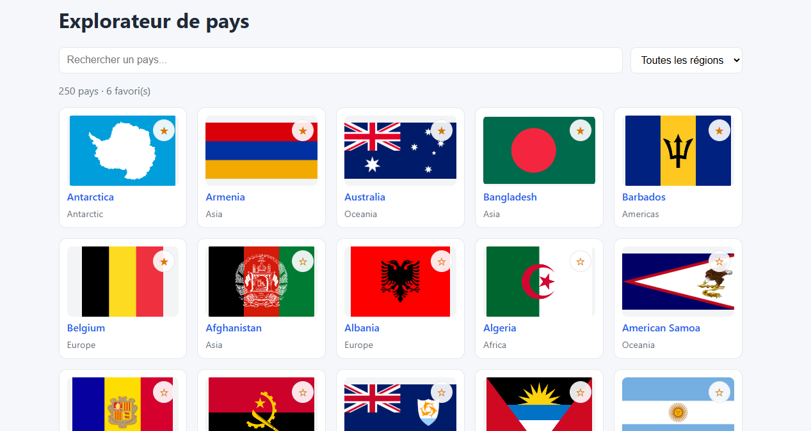
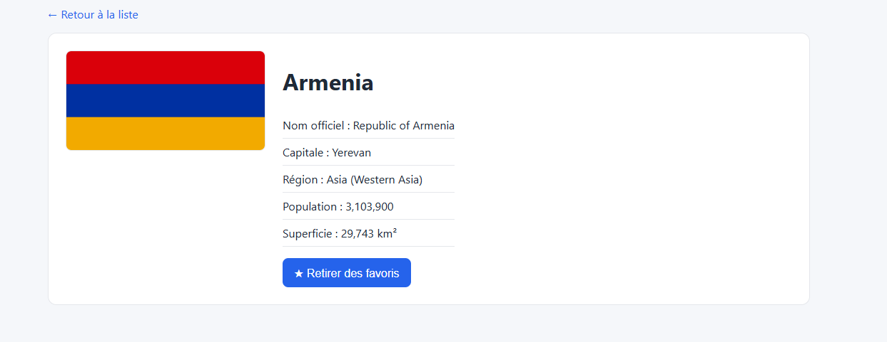

# 🌍 Explorateur de pays

Mini-application Angular permettant de rechercher, filtrer et consulter des informations sur les pays du monde, avec un système de favoris persistant.

Projet réalisé en une journée pour découvrir Angular moderne (composants standalone, signals) avant un entretien technique.

## Aperçu




## Fonctionnalités

- 🔍 Recherche de pays par nom (en temps réel)
- 🌐 Filtre par région (Europe, Asie, Afrique...)
- 📄 Page détail par pays (capitale, population, superficie, région)
- ⭐ Favoris persistants (localStorage), avec tri automatique en tête de liste
- 📱 Interface responsive

## Stack technique

- **Angular** (composants standalone, signals, nouvelle syntaxe de contrôle `@if` / `@for`)
- **TypeScript** (interfaces, typage strict)
- **RxJS** (Observables, `map`, `forkJoin`)
- **Formulaires réactifs** (`FormControl`, `toSignal`)
- **Angular Router** (routes avec paramètres)
- **API** : [REST Countries](https://restcountries.com/) (v5)
- **CSS** natif (variables CSS, grid responsive)

## Installation

```bash
git clone https://github.com/ansenthandrayen/explorateur-pays.git
cd explorateur-pays
npm install
```

Ce projet nécessite une clé d'API gratuite (REST Countries v5 impose une authentification).

1. Créer un compte sur https://restcountries.com/sign-up
2. Récupérer la clé sur https://restcountries.com/api-keys et ajouter `localhost` dans les origines autorisées
3. Copier `src/app/api-key.example.ts` en `src/app/api-key.ts` et y coller la clé :

```ts
export const API_KEY = "ta_cle_ici";
```

## Lancer le projet

```bash
ng serve
```

Puis ouvrir http://localhost:4200

## Ce que j'ai appris

- La différence entre composants standalone et NgModules
- Le fonctionnement des signals (`signal`, `computed`) face au changement d'état
- Les Observables RxJS et l'abonnement (`subscribe`), différents d'une Promise
- Les formulaires réactifs (`FormControl`, `valueChanges`)
- Le routing Angular avec paramètres de route
- Lire et déboguer des erreurs HTTP (CORS, 401, 403) à partir de la console navigateur
- Adapter un projet en cours de route suite à une migration d'API (v3.1 → v5, dépréciée en cours de développement)

## Limites connues / pistes d'amélioration

- La clé d'API est visible côté client (limite inhérente à une clé publique sans backend) ; une vraie mise en production passerait par un petit serveur proxy
- Les 3 requêtes de la liste complète sont codées en dur (pagination simple), plutôt que de suivre dynamiquement `meta.more`
- Tests unitaires minimaux (un test sur le service de favoris)
- Pas de gestion i18n / formats régionaux (nombres affichés en format anglais)

## Auteur

Ansen — [github.com/ansenthandrayen](https://github.com/ansenthandrayen)
